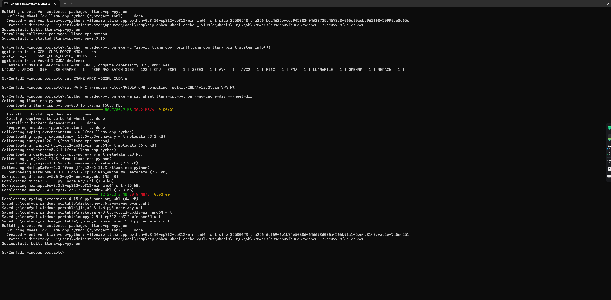

# llama-cpp-python v0.3.16 (Optimized for CUDA 13.0)

这是针对 NVIDIA RTX 4080 Super 及 CUDA 13.0 环境本地编译生成的 llama-cpp-python 预编译包。

🌟特点：
原生适配 CUDA 13.0: 解决了在最新 CUDA 环境下常见的 cudaGetDeviceProperties_v2 输入点找不到的报错。

架构针对性优化: 针对 Ada Lovelace (sm_89) 架构编译，充分发挥 40 系列显卡的 Tensor Core 性能。

高性能支持: 完美支持 Qwen3 (GGUF) 及其他主流模型的 GPU 加速推理。

💻 编译环境 (Build Specs)
本文件不保证适用所有系统，请在下载前核对你的运行环境：

OS: Windows 10/11 x64

GPU: NVIDIA RTX 40 系列 (推荐 4080S / 4090)

Compute Capability: sm_89 (ARCHS = 890)

Python: 3.12.x (基于 Python 3.12.10 编译)

CUDA Toolkit: 13.0

* 文件件名采用社区通用的规范进行了修改更为直观：llama_cpp_python-0.3.16+cu130avx2-cp312-cp312-win_amd64.whl
  
🛠️ 安装方法 (Installation)
下载附件中的 .whl 文件。
在你的 Python 环境（或 ComfyUI 便携版环境）中运行：

:: 替换为你的实际路径

    .\python_embeded\python.exe -m pip install "llama_cpp_python-0.3.16+cu130avx2-cp312-cp312-win_amd64.whl" --force-reinstall

🖼️ 运行验证 (Verification)

安装后建议运行以下命令确认 CUDA = 1:
       
    .\python_embeded\python.exe -c "import llama_cpp; print(llama_cpp.llama_print_system_info())"
